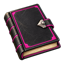

# Boojie Notebook



Boojie Notebook is an in-game notebook for World of Warcraft. It keeps notes, checklists, and reference material close at hand without requiring you to leave the game.

Create entries for your entire account or keep separate notebooks for individual characters. A searchable, resizable interface makes it easy to organize everything from raid reminders and profession plans to character-specific goals.

## Features

- Account-wide and character-specific notebooks
- Dedicated sections for notes, lists, and references
- Search across every section of the selected notebook
- Pinnable entries for quick access
- Checklists and numbered lists
- Duplicate, move, or copy entries between notebooks
- Creation and edit dates for every entry
- Resizable interface with saved dimensions
- Movable minimap button
- Custom fonts, font sizes, colors, backgrounds, and transparency
- Built-in Horde, Alliance, class, and BoojiePink themes
- Optional ElvUI theme matching
- Optional Bellota fonts from `SharedMedia_MyMedia`

## Installation

1. Download or clone this repository.
2. Place the `BoojieNotebook` folder in your World of Warcraft Retail addon directory:

   ```text
   World of Warcraft/_retail_/Interface/AddOns/
   ```

3. Confirm the final path is:

   ```text
   Interface/AddOns/BoojieNotebook/BoojieNotebook.toc
   ```

4. Restart World of Warcraft or reload the interface.
5. Enable **Boojie Notebook** from the AddOns menu on the character-selection screen.

## Usage

Open or close the notebook with the minimap button or either slash command:

```text
/boojienotes
/bn
```

The addon also preserves the shared Boojie addon `/rl` shortcut for reloading the interface.

Choose a notebook from the left sidebar, then select **Notes**, **Lists**, or **References**. Entries save automatically as you type. Use the search field to search all three sections of the current notebook.

Appearance settings are available directly in the notebook sidebar. The addon can also be opened from **Options > AddOns > Boojie Notebook**.

## Saved Data

Boojie Notebook stores its content in World of Warcraft's standard SavedVariables system under `BoojieNotebookDB`. Data remains local to your World of Warcraft installation and is not transmitted anywhere.

To back up your notebooks, include the appropriate `BoojieNotebook.lua` SavedVariables file from your account's `WTF` directory in your normal World of Warcraft backup.

## Compatibility

- World of Warcraft Retail
- Interface version: `120100`
- ElvUI is optional
- SharedMedia_MyMedia is optional

## Feedback and Issues

If you find a bug or have an idea for an improvement, open an issue on this repository with a clear description and the steps needed to reproduce the behavior.

## Author

Created by SilverRavyn.
